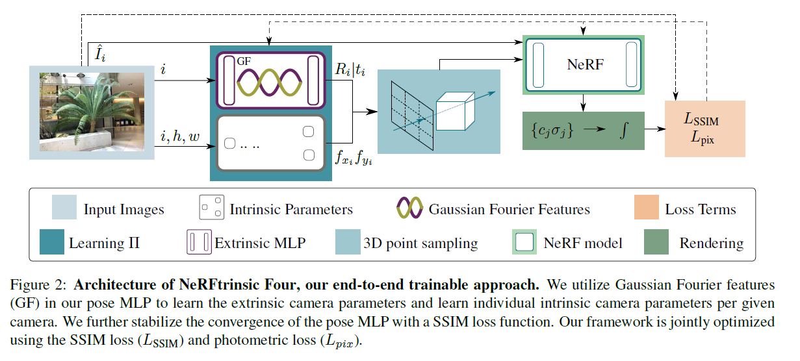

# NeRFtrinsic Four: An End-To-End Trainable NeRF Jointly Optimizing Diverse Intrinsic and Extrinsic Camera Parameters

Novel view synthesis using neural radiance fields (NeRF) is the state-of-the-art technique for generating high-quality images from novel viewpoints. Existing methods require a priori knowledge about extrinsic and intrinsic camera parameters. This limits their applicability to synthetic scenes, or real-world scenarios with the necessity of a preprocessing step. Current research on the joint optimization of camera parameters and NeRF focuses on refining noisy extrinsic camera parameters and often relies on the preprocessing of intrinsic camera parameters. Further approaches are limited to cover only one single camera intrinsic. To address these limitations, we propose a novel end-to-end trainable approach called NeRFtrinsic Four. We utilize Gaussian Fourier features to estimate extrinsic camera parameters and dynamically predict varying intrinsic camera parameters through the supervision of the projection error. Our approach outperforms existing joint optimization methods on LLFF and BLEFF. In addition to these existing datasets, we introduce a new dataset called iFF with varying intrinsic camera parameters. NeRFtrinsic Four is a step forward in joint optimization NeRF-based view synthesis and enables more realistic and flexible rendering in real-world scenarios with varying camera parameters.

# Joint optimization

# How to train
## Pytorch
torch==1.13.1+cu117
torchaudio==0.13.1+cu117
torchvision==0.14.1+cu117 
## Environment
- install requirements.txt
## Data
- Download datasets
   - unzip the example data.zip
   - make sure you have the structure
       - data/
            - iFF/T1
            - LLFF/fern
   - **note! we only have poses_bounds for reference**
# Train
  we provide two examples on from LLFF, the fern scene the other one from our own dataset iFF, the T1 scene

### iFF
``python tasks/nertrinsic_four_train/train_gf.py --base_dir data/iFF --scene_name T1``
### LLFF
``python tasks/nertrinsic_four_train/train_gf.py --base_dir data/LLFF --scene_name fern``

# Dataset

Dataset can be found at ANONYMIZED.

# Acknowledgment

If you cite our work, make also sure to take a look at NeRF--, as the initial general joint optimization idea for intrinsic and extrinsic camera parameters was presented there.

Nevertheless, **we contribute** a joint optimization of **differing** intrinsic camera parameters and use **Gaussian Fourier** features for our extrinsic camera parameter prediction.
